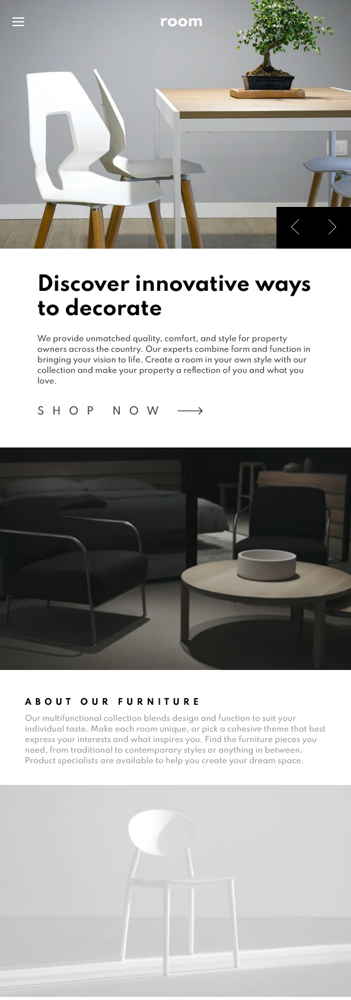

# Frontend Mentor - Room homepage solution

This is a solution to the [Room homepage challenge on Frontend Mentor](https://www.frontendmentor.io/challenges/room-homepage-BtdBY_ENq). Frontend Mentor challenges help you improve your coding skills by building realistic projects.

## Table of contents

-   [Overview](#overview)
    -   [The challenge](#the-challenge)
    -   [Screenshot](#screenshot)
-   [My process](#my-process)
    -   [Built with](#built-with)
-   [Author](#author)

## Overview

### The challenge

Users should be able to:

-   View the optimal layout for the site depending on their device's screen size
-   See hover states for all interactive elements on the page
-   Navigate the slider using either their mouse/trackpad or keyboard

### Screenshot

## My process

### Built with

-   CSS
-   Flexbox
-   JS
-   Responsive
-   [React](https://reactjs.org/) - JS library
-   JSX

## Author

-   Frontend Mentor - [@Flaviogameover](https://www.frontendmentor.io/profile/Flaviogameover)
